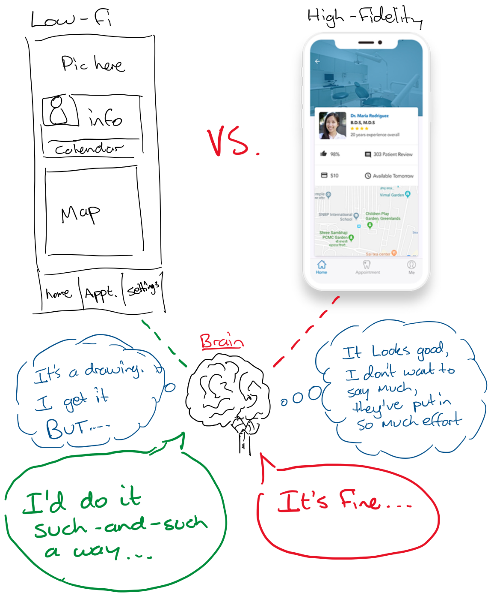

# Why Low Fidelity (Low-Fi) Works

Low fidelity mock ups and prototypes are great for validation. Why? Because when something looks scrappy and thrown together, whoever is looking at your prototype is not having unconscious processes _interfering with their perception_.

**Your Brain Plays Tricks on You**

When you look at a beautiful mock-up of a new product, and someone asks you for your opinion, several things happen inside your brain. Chief among these processes is not wanting to upset/hurt the person asking for feedback. In real life, we udnerstand that nobody wants to be told _"Your baby is ugly"_, and our brains apply that same process to other things people make.

In products and mock-ups, this can lead to feedback that basically summarises to "It's good" or "it's fine" rather than any deep validation.

When you show someone something sketched or put together with bubble gum & chicken wire, the person your validating with will know it's safe to critique. _It's not your baby_. You will get a lot more useful feedback with low-fi mockups. :-)

